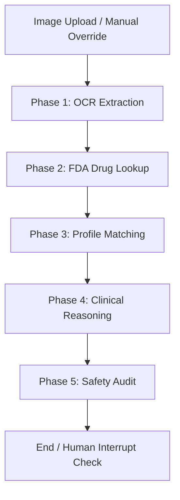

# 💊 MedChecker AI — Clinical Safety Platform

MedChecker AI is a modern, state-of-the-art decision support pipeline built with **LangGraph**, **PaddleOCR**, **Groq LLMs**, and the **RxNorm/openFDA APIs**. It scans prescription label images, retrieves official regulatory warnings, compares them against a localized patient profile database, and outputs color-coded clinical safety verdicts with secondary audit scores.

---

## ⚙️ Architecture & Pipeline Flow

The LangGraph workflow runs through 5 sequential phases:



1. **🔍 OCR Extraction (Phase 1)**: Preprocesses the raw label image (deskewing, contrast enhancement, noise reduction) and runs PaddleOCR to read the text. A Groq LLM parses the text to extract the normalized generic active ingredient name and dosage.
2. **💊 FDA Drug Lookup (Phase 2)**: Resolves the active ingredient RxCUI through RxNorm API and queries openFDA to fetch official safety warnings (Contraindications, Boxed Warnings, Drug/Food Interactions, and Pregnancy risks).
3. **🧩 Profile Matching (Phase 3)**: Syncs the queried drug's safety warnings against the patient's local clinical history (diseases, allergies, and current medications from `patient_profiles.json`).
4. **🧠 Clinical Reasoning (Phase 4)**: Groq evaluates the combined risk context, returning structured safety decisions (`APPROVE`, `DENY`, or `HOLD_FOR_REVIEW`) along with a medical explanation and specific interaction warnings.
5. **🛡️ Safety Audit (Phase 5)**: A secondary senior medical auditor agent scores the accuracy of the reasoning (0.0 to 1.0) and assesses the risk/emergency level (1 to 10). If confidence is low or risk is high, it flags the case for mandatory human review.

---

## 🛠️ Prerequisites

* **Python**: `3.12`
* **Package Manager**: [uv](https://github.com/astral-sh/uv) (highly recommended for rapid dependency resolution and workspace virtual environments)

---

## 🚀 Installation & Setup

### 1. Configure Environment Variables
Create a `.env` file in the project root and add your Groq API Key:

```env
GROQ_API_KEY="your-groq-api-key-here"
```

### 2. Synchronize Dependencies
Use `uv` to install the requirements and build the virtual environment:

```bash
uv sync
```

*This will configure the workspace venv and download all required packages (Streamlit, PaddlePaddle, OpenCV, LangChain, etc.).*

---

## 🖥️ Running the Application

To launch the premium dark-mode Streamlit UI, execute:

```bash
uv run streamlit run app/streamlit_app.py
```

Streamlit will print the local server URL:
```text
  You can now view your Streamlit app in your browser.

  Local URL: http://localhost:8501
  Network URL: http://192.168.1.105:8501
```

Open **`http://localhost:8501`** in your browser.

> ℹ️ **First Run Warning**: On your very first run, PaddleOCR will automatically download 5 deep learning models (`PP-OCRv6`, `UVDoc`, etc.) to `C:\Users\<User>\.paddlex\`. This one-time setup takes 1–3 minutes depending on your internet connection. Subsequent analysis runs will skip the download and finish in seconds.

---

## 🐳 Running with Docker

Docker is the easiest way to run MedChecker AI — no Python, no uv, no dependency issues. Just Docker Desktop.

### Prerequisites

* [Docker Desktop](https://www.docker.com/products/docker-desktop/) installed and running

### 1. Configure Environment Variables

Create a `.env` file in the project root:

```env
GROQ_API_KEY="your-groq-api-key-here"
```

### 2. Build the Image

```bash
docker compose build
```

> ℹ️ **First Build Warning**: The build downloads PaddleOCR models (~200MB) and all Python dependencies. This takes 5–10 minutes on first run. Subsequent builds are fast thanks to Docker layer caching.

### 3. Run the Container

```bash
docker compose up -d
```

Open **`http://localhost:8501`** in your browser.

### 4. Stop the Container

```bash
docker compose down
```

### Useful Docker Commands

| Command | What it does |
|---|---|
| `docker compose build` | Build the image |
| `docker compose up -d` | Start in background |
| `docker compose down` | Stop and remove container |
| `docker compose logs -f` | View live logs |
| `docker compose ps` | Check container status |
| `docker compose build --no-cache` | Force full rebuild |

---

## 🧑‍⚕️ How to Use the UI

1. **Sidebar Patient Select**: Choose a patient ID (e.g. `PATIENT-003`) from the dropdown. The sidebar will render their medical card showing active chronic conditions, known drug allergies, and current medication list.
2. **Upload Label**: Drag and drop a sample drug label image (e.g., from `data/samples/`) into the upload dropzone.
3. **Manual Override fallback**: If an image is extremely blurry or OCR fails, click on the **✏️ Override Drug Name** expander and manually type the active ingredient name (e.g., `ibuprofen` or `warfarin`). The system will bypass OCR and query the safety APIs directly.
4. **Run Analysis**: Click the **⚡ Run Analysis** button. You'll see real-time pipeline status progress bars as each LangGraph node processes.
5. **View Results Dashboard**:
   - **Verdict**: View the color-coded badge (`✅ APPROVE`, `🚫 DENY`, `⏸️ HOLD FOR REVIEW`) alongside a medical reason description.
   - **Risk Gauge Bars**: Monitor the **Accuracy Score** and **Emergency Level** gauges.
   - **Human Review Alert**: Check if the case meets safe automatic threshold approvals or demands manual verification.
   - **FDA Data**: Expand the details card to read raw FDA warnings for active ingredients.
   - **Raw State JSON**: For developers, toggle the raw state JSON expander to audit pipeline data passing through the graph nodes.
